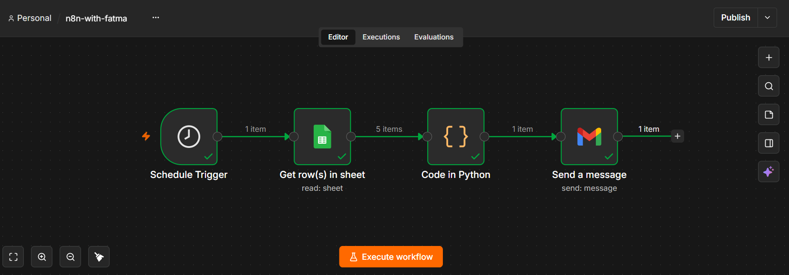

# Daily Task Email Automation

An n8n workflow that automatically sends a restaurant's daily task list by email every morning at 8:00 AM.

## Problem

A restaurant owner needs to receive his daily tasks every morning at 8:00 AM.

Manually checking the task list and sending it by email every day is repetitive and time-consuming.

## Solution

I built an n8n workflow that automatically retrieves the daily tasks from Google Sheets, processes them using Python, and sends them by email at 8:00 AM every day.

## How It Works

1. The workflow starts automatically at 8:00 AM using a Schedule Trigger.
2. It retrieves the daily tasks from Google Sheets.
3. A Python Code node combines the tasks into one message.
4. Gmail sends the task list by email.

## Workflow

Schedule Trigger → Google Sheets → Python → Gmail

## Technical Challenge

While building the workflow, I encountered an issue with the Python Code node where `_input` was not defined in my n8n environment.

## Solution to the Challenge

I adjusted the Python code to work with the input data provided by the previous Google Sheets node and successfully processed the multiple task items into a single text message.

## Tools Used

- n8n
- Google Sheets
- Python
- Gmail

## What I Learned

- Building workflows with n8n
- Using Schedule Triggers
- Integrating Google Sheets with n8n
- Processing workflow data using Python
- Working with JSON data
- Automating email notifications
- Debugging workflow errors
- Documenting automation projects

## Result

The restaurant's daily task list is automatically sent by email every morning at 8:00 AM without requiring manual intervention.

## Workflow Preview

